# GDD: Player Progression System

### Progression System Summary (GDD Overview)

This document outlines a player progression system designed for a modern ARPG. The core philosophy is to reward **strategic player choice** over sheer time investment. A player's level functions not as the primary source of power, but as a **key that gates access to greater power** through a deep loot system and a meaningful skill tree.

The system is built on three pillars:

1.  **Exponential XP Curve:** Ensures a fast-paced early game to maximize engagement and a challenging, long-term endgame for player retention.

	While other progression models (such as linear or logarithmic curves) were considered, the **exponential XP curve was specifically chosen** for this system. This decision ensures a better match for the classic RPG style, providing immediate early-game progress and a sustained, challenging grind for the long-term endgame.

2.  **Dynamic XP Modifier:** Actively guides players toward level-appropriate content by severely penalizing the farming of trivial enemies while rewarding skilled players who defeat higher-level foes.

3.  **Multi-Faceted Reward Structure:** Power is gained through three avenues:
    *   **Stats:** A balanced attribute system that defines a character's core archetype.
    *   **Skill Points:** The primary motivation for leveling, allowing tangible improvements to abilities.
    *   **Loot:** The ultimate driver of endgame power, with the best gear locked behind level requirements.

This design creates a robust and sustainable game loop where players are constantly motivated to challenge themselves to unlock the next tier of gear and skills, ensuring a deep and rewarding experience.

## 1. Design Philosophy

This document details the player progression system for a new ARPG. The core philosophy is that a player's power should be a direct reflection of their **strategic choices**, not just their time investment. A player's level is not the ultimate source of their power but rather the **key that unlocks access to greater power** through gear (Loot) and skill specialization.

This system is engineered to:
*   Naturally **guide the player** towards challenging and engaging content.
*   **Reward player risk-taking and skill**.
*   **Prevent stagnation** in trivial farming zones.
*   Create an addictive and sustainable game loop from the early game through the endgame.

## 2. Pillar I: The Player's Journey (Experience Curve)

The foundation of the player's journey is the experience (XP) requirement for leveling up. We have adopted an **exponential curve** to ensure a dynamic game pace.

### 2.1. Required XP Formula

The XP required to reach Level `LVL` is calculated using the following formula:

``` XP = BASE * ((LVL - 1) ^ EXP) + OFFSET ```

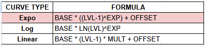

*   **BASE:** Controls the curve's starting value.
*   **EXP:** The exponent that defines the curve's acceleration. A value of `1.5` ensures that the cost of each level increases significantly in the late game.
*   **OFFSET:** A flat value to fine-tune the curve if necessary.

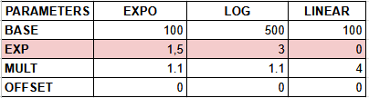

### 2.2. Design Implications

*   **Early Game (Levels 1-40):** The curve is relatively gentle, allowing new players to level up quickly and feel a sense of constant progress, fostering initial engagement.
*   **Late Game (Levels 80+):** The curve steepens dramatically. Leveling becomes a major achievement, setting the expectation that gear and skills—not the level itself—are the primary drivers of power.

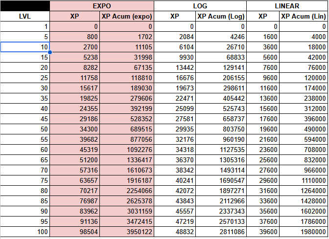

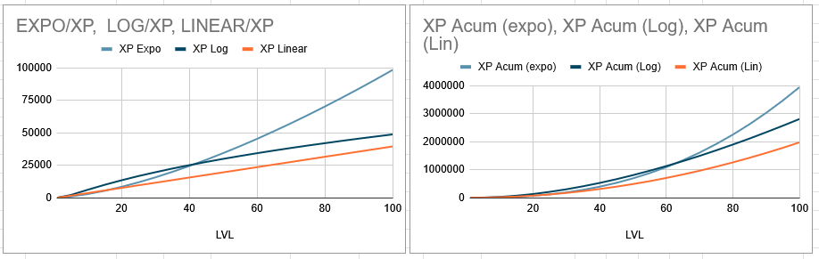

## 3. Pillar II: The Pacing Engine (XP Modifier by Level Differential)

To actively guide the player and control the game's pace, the XP gained from an enemy is not fixed. It is dynamically modified based on the level difference between the player and the enemy.

### 3.1. The Modifier Curve

The XP multiplier follows a carefully designed curve with three key phases:

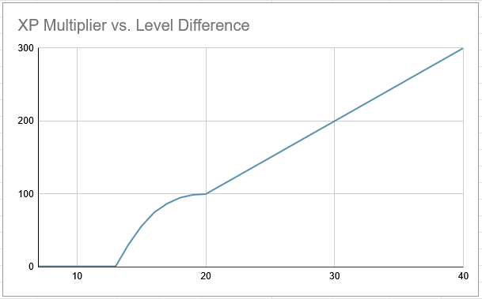


*   **Phase 1: The Relevance Floor (Anti-Grind Mechanism)**
    *   **Description:** When a player is 8 or more levels higher than an enemy, the XP gained is reduced to a nominal value (e.g., 1 XP).
    *   **Psychological Effect:** The player learns, both visually and mechanically, that farming "gray" (trivial) enemies is a complete waste of time. This combats monotony and pushes the player to move forward.

*   **Phase 2: The Combat Zone (The S-Curve Ramp)**
    *   **Description:** Between a level difference of +7 and 0, the XP reward increases along an S-shaped curve. This creates a smooth transition from near-zero XP to the full 100% base reward.
    *   **Psychological Effect:** This defines the player's "comfort zone." Enemies within this range are the primary target for efficient and safe farming.

*   **Phase 3: The Heroic Incentive (Risk & Reward)**
    *   **Description:** For each level an enemy is higher than the player, a linear XP bonus is awarded (e.g., +10% per level).
    *   **Psychological Effect:** This directly rewards skill. A player who, through superior gear or flawless execution, defeats a higher-level enemy receives a tangible reward and feels powerful.

### 3.2. Modifier Table

| Difference (Player - Enemy) | XP Multiplier |
| :--- | :--- |
| +8 or more | 0.01x (1 XP) |
| +7 | 0.32x |
| +2 | 0.96x |
| 0 | 1.00x |
| -2 | 1.20x |
| -5 | 1.50x |
| -10 | 2.00x |
| -20 | 3.00x |

### XP multiplier Calculation Formula by Level Disparity

Let $L_P$ be the Player Level, $L_E$ the Enemy Level, and $XP_B$ the Enemy Base XP.

The Level Difference is defined as:
$$\Delta L = L_P - L_E$$

The Multiplier ($M$) is calculated in two conditional cases:

#### Case 1: Player Level $\leq$ Enemy Level ($\Delta L \leq 0$)
$$M_{Bonus} = \min \left( 1.0 + (-\Delta L \cdot 0.1), \quad 3.0 \right)$$

#### Case 2: Player Level $>$ Enemy Level ($\Delta L > 0$)
$$M_{Penalty} = 1.0 - \left( \frac{\Delta L}{7} \right)^{2.5}$$

***

#### Final Result (Clamping)

The final Multiplier ($M_{Final}$) is the result of the relevant case:
$$M_{Final} = \max \left( M_{Case}, \quad 0.01 \right)$$

The Final XP ($XP_F$) is calculated and clamped:
$$XP_F = \max \left( 1, \quad \lfloor XP_B \cdot M_{Final} \rfloor \right)$$

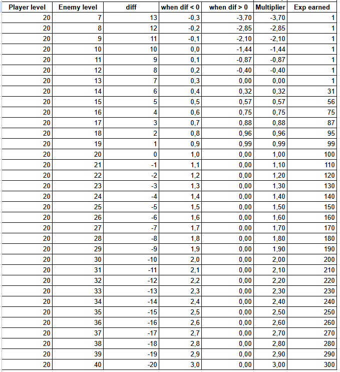

## 4. Pillar III: The Reward Structure

The effort of earning XP translates into power through three interconnected systems: Stats, Skills, and Loot.

### 4.1. Attribute System (Stats)

### 4.1.1 Attribute Scaling System Overview

The player's power is structured around a two-tiered system: **Primary Attributes** and **Secondary Attributes**.

1.  **Primary Attributes (Investable):** These stats are directly increased by investing **Stat Points (SP)** earned upon leveling up.
2.  **Secondary Attributes (Derived):** These stats are calculated dynamically based on the Primary Attributes, the Player Level, and a constant Base value.

The character's core is defined by four primary attributes that scale linearly and are well-balanced:
*   **STR (Strength):** Powers physical damage (P_ATK), physical defense (P_DEF), and physical energy (SP).
*   **STA (Stamina):** The primary source of survivability (HP) and base defenses.
*   **DEX (Dexterity):** Governs agility, including attack speed (Speed), critical strike chance (Crit Chance), and contributes to physical energy (SP).
*   **INT (Intelligence):** Powers magical damage (M_ATK), magical defense (M_DEF), and magical energy (MP).

#### 4.1.2 Derivation Formula

The Secondary Attributes are calculated using the following linear combination formula:

$$\text{Secondary Stat} = \left( \sum_{i} (\text{Primary Stat}_i \cdot \text{Coefficient}_i) \right) \cdot \text{Factor} + (\text{LVL} \cdot \text{Level Bonus}) + \text{Base}$$

This ensures that the Secondary Stats (such as Crit Chance, Damage, and Defenses) scale predictably while maintaining clear dependencies on the Primary Attributes.

| **Description** | **Graph** |
| :--- | :--- |
| Table displaying the Stat definition parameters (can be modified for change progress behavior) | 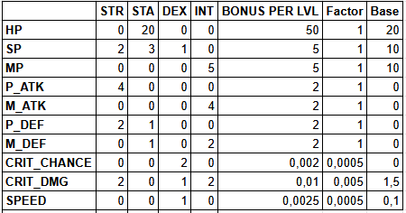 |

### 4.1.2.1 Base Attribute Progression (No SP Investment)

The following table and graph illustrate the character's **Base Attribute Progression**. These values represent the inherent growth of attributes driven *only* by the Player Level, with **no Stat Points (SP) added**. This serves as the minimum power floor for any character build.

| **Description** | **Graph** |
| :--- | :--- |
| Base stat progression over player level without SP. | 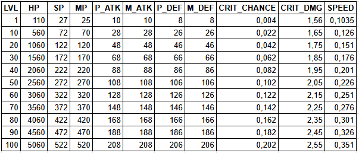 |
| Graph visualizing the base stat progression curve. | 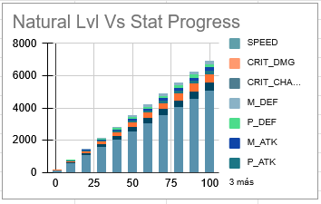 |

### 4.1.2.2 Sample Archetypes and Attribute Allocation

To demonstrate the versatility and impact of SP investment, the following section showcases specific attribute allocations (Builds) at key progression milestones (Level 50 and 100). These tables illustrate the intentional trade-offs and specialization created by the system.

#### Archetype Allocation Table (SP Investment)

This table shows the **Stat Point (SP)** investment across the primary attributes for various character archetypes.

| **Description** | **Graph** |
| :--- | :--- |
| Table detailing primary attribute (STR, STA, DEX, INT) investment for sample Level 50 and Level 100 character builds. | 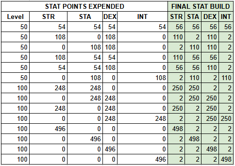 |

#### Derived Attribute Results (Impact of Builds)

The following table displays the calculated **Secondary Attribute** results (HP, P_ATK, Crit Chance, Speed, etc.) for each corresponding archetype shown in the allocation table. These values confirm the successful isolation of the build's intended strength and weakness.

| **Description** | **Graph** |
| :--- | :--- |
| Table displaying the resulting derived secondary stats (P_ATK, HP, Crit Chance, Speed, etc.) for the different Level 50 and 100 builds. | 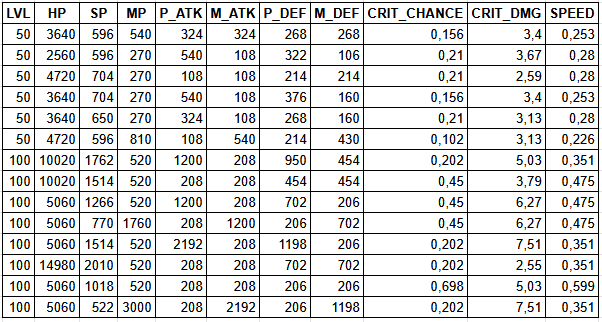 |


#### 4.1.3 Milestone Rewards

To enhance the feeling of progression, **Bonus SP** is awarded upon reaching specific level milestones. This mechanic rewards the player's commitment and allows for significant, periodic increases in core power, further reinforcing the leveling process.

| **Description** | **Graph** |
| :--- | :--- |
| Table displaying the Stat points bonus for different player levels | 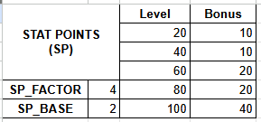 |


This design avoids a "God Stat" problem, forcing the player to make meaningful decisions about their specialization.


### 4.2. Skill Points

**The primary motivation for leveling up is to earn Skill Points.** Each "Ding!" grants points that the player invests in skill trees to improve the potency, add secondary effects, or reduce the costs of their active and passive abilities. This makes every level feel like an immediate and tangible reward.

### 4.3. Gear (Loot)

Gear is the main driver of power in the endgame. **Levels function as gates** that restrict access to the best equipment.
*   **Game Loop:** A player finds a legendary sword that requires Level 90. This creates a clear goal and motivates the player to use the XP system's "Heroic Incentive" to reach that level faster. Once equipped, that sword allows them to tackle even harder content, where they can find even better loot.

## 5. Risk Analysis & Balancing Levers

A well-designed system anticipates its own failure points.

*   **Risk 1: Multiplayer Power-Leveling.**
    *   **Problem:** A high-level player could abuse the "Heroic Incentive" to boost a low-level friend at an unintended, game-breaking pace.
    *   **Balancing Lever:** Implement a group XP formula that averages party member levels or applies a penalty if the level disparity within the group is too large.

*   **Risk 2: The "Wall of Frustration."**
    *   **Problem:** If enemy difficulty scales exponentially, the linear XP bonus may not be enough to justify the risk, creating a "wall" where players cannot progress.
    *   **Balancing Lever (Skills & Loot):** Skill and item affix design is crucial. Utility skills (stuns, slows, shields) and defensive gear effects (life steal, evasion) are the tools that will allow a skilled player to overcome a raw stat disadvantage.

*   **Risk 3: The "Useless Tank" Build.**
    *   **Problem:** A "Full STA" build might be immortal but have such low damage output that the game becomes boring to play.
    *   **Balancing Lever (Skills):** Design tank-specific skills whose damage scales not with STR/INT, but with defensive stats like Max HP or P_DEF. This ensures that all specializations are both viable and fun.

## 6. Conclusion

This progression system creates a robust symbiosis between player effort and reward. It intelligently guides the player, rewards boldness, and establishes a solid framework for a deep and lasting endgame driven by the hunt for legendary gear and the optimization of skill builds. The system is ready for implementation and subsequent fine-tuning during playtesting phases.

***(Scope Limitation)***
*It is critical to note that the detailed specifications for the **Skills System** and **Loot/Itemization** are not included in this document's scope. These auxiliary systems must be designed as the essential counterparts to the attribute scaling and will serve as the primary balancing tools during the playtesting phase to meet the power scaling demands of the endgame.*
