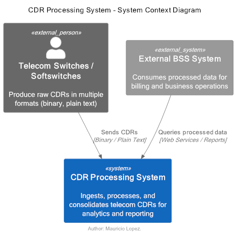
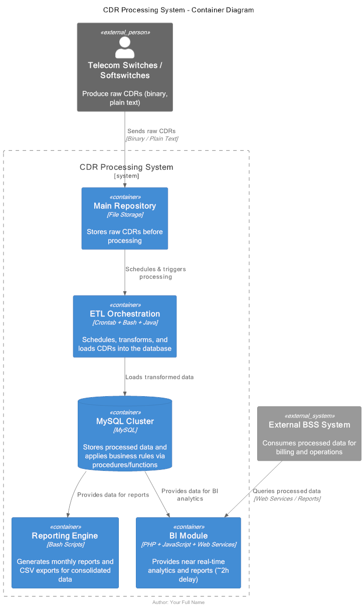
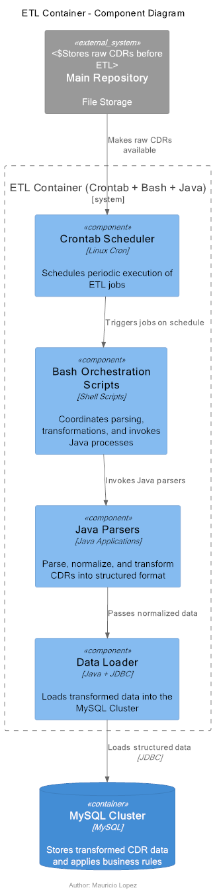

# CDR Processing & BI System

## 📘 Overview
This project implements a **telecom-grade ETL pipeline** that ingests, normalizes, and consolidates **Call Detail Records (CDRs)** from multiple network elements (AWSd, AXE, ZTE, Huawei, Softswitch).  

The system supports **multi-format CDRs (binary & plain text)**, consolidates data in a **MySQL cluster**, and provides **near real-time analytics** via a BI module and reporting engine.

---

## 📐 Architecture Diagrams (C4 Model)

The system architecture is documented using the **C4 Model** for software architecture, supported with PlantUML diagrams.

### 1. System Context (Level 1)
Shows the **CDR Processing System** as a black box, its external dependencies, and consumers.

📄 [PlantUML source](./docs/C4_L1.puml)

**Explanation:**
- **Telecom Switches / Softswitches** send raw CDRs (binary, plain text).  
- **CDR Processing System** ingests, processes, and makes data available.  
- **External BSS System** queries processed data for billing and business operations.  

---

### 2. Container Diagram (Level 2)
Breaks down the **CDR Processing System** into major containers and their interactions.

📄 [PlantUML source](./docs/C4_L2.puml)

**Key Containers:**
- **Main Repository** → Raw file storage.  
- **ETL Orchestration** → Crontab + Bash + Java parsing.  
- **MySQL Cluster** → Centralized storage with procedures/functions for business rules.  
- **BI Module** → Web services and dashboards for near real-time analytics.  
- **Reporting Engine** → Bash-based scripts to generate consolidated CSV reports.  

---

### 3. Component Diagram (Level 3 - ETL)
Details the **ETL Container**, showing its internal components.

📄 [PlantUML source](./docs/C4_L3_ETL.puml)

**Components:**
- **Crontab Scheduler** → Triggers ETL jobs periodically.  
- **Bash Orchestration Scripts** → Coordinate and call Java processes.  
- **Java Parsers** → Parse, normalize, and transform CDRs.  
- **Data Loader** → Loads structured data into the MySQL Cluster.  

**External Context:**
- **Main Repository** → Provides raw CDR files.  
- **MySQL Cluster** → Stores processed data.  

---

## 🔧 Tech Stack

- **Languages**: Java, PHP, JavaScript, Bash  
- **Database**: MySQL (Cluster + Data Warehouse)  
- **Scheduling**: CRONTAB  
- **Architecture Modeling**: PlantUML (C4 model)  

---

## 🚀 Key Features

- Multi-format CDR ingestion (binary/plain text)  
- ETL process with orchestration and transformation  
- Data consolidation in MySQL cluster  
- Web-based BI services with ~2h data freshness  
- Automated reporting engine (CSV, consolidated reports)  

---