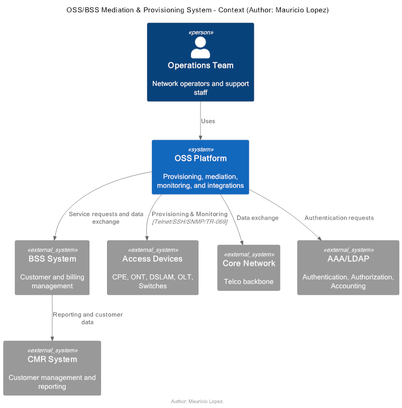
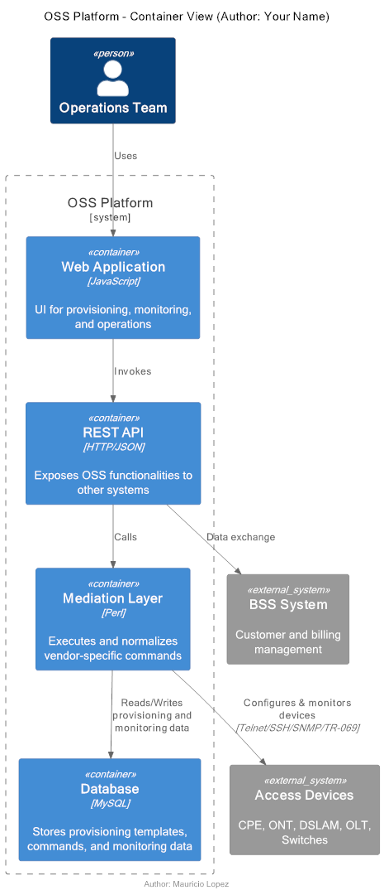
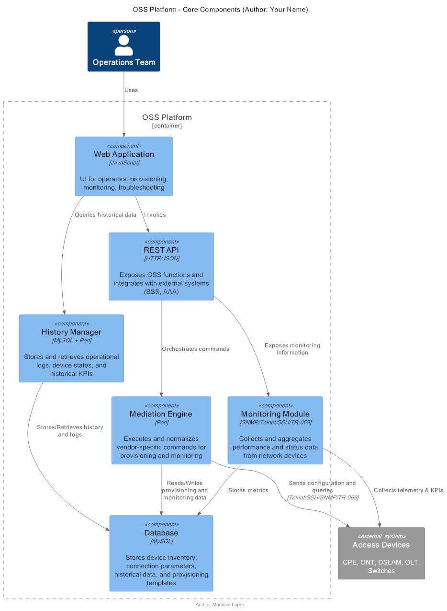

# OSS/BSS Mediation & Provisioning System (Multi-vendor)

This project represents a **multi-vendor OSS platform** designed for telecom environments, enabling automated provisioning, monitoring, and customer support across Level 1 to Level 3 operations.  
It integrates heterogeneous access devices with a centralized OSS, providing agility, scalability, and reliability in network operations.

---

## 📌 My Role & Contributions
- **Mediation Layer (Perl):** Implemented the core mediation logic for device command normalization, enabling multi-vendor and multi-protocol support.  
- **Database (MySQL):** Designed and extended schemas for provisioning workflows, command repositories, and monitoring data.  
- **OSS Integrations:** Contributed to the data exchange between OSS, BSS, and reporting systems.  
- **Device Testing:** Validated CPEs and ONTs through **Telnet, SSH, SNMP, and TR-069** protocols.  

---

## 🚀 Key Features & Impact
- **Multi-vendor agnostic:** Supports DSLAM, OLT, ONT, CPE, and switches from different vendors.  
- **Dynamic automation:** Provisioning commands stored and managed from the database, enabling one-click provisioning and zero-touch workflows.  
- **Integrated monitoring:** Real-time operational visibility across access and core network elements.  
- **Scalability:** Designed to handle thousands of devices concurrently across multiple protocols.  
- **End-to-end operations:** Supports troubleshooting and service management from Level 1 helpdesk up to advanced Level 3 engineering.  
- **Unified support platform:** Consolidated multiple tools into a single OSS for provisioning, monitoring, and troubleshooting.  
- **Provisioning efficiency:** Reduced provisioning times by more than **80%** through automation and workflow optimization.  
- **Faster support resolution:** Reduced diagnostic and support times by more than **70%** by centralizing monitoring and historical data.  

---

## 🗂️ Architecture Diagrams (C4 Model with PlantUML)

All diagrams are available both as **PlantUML source (`.puml`)** and as **rendered PNGs (`.png`)**.  
You can view the rendered images below or explore the source files inside the [`diagrams/`](./diagrams) folder.

---

### Level 1 – System Context
- [PUML Source](./docs/OSS_C4_L1.puml)  
- [Rendered PNG](./diagrams/OSS_C4_L1.png)  

---

### Level 2 – Container View
- [PUML Source](./docs/OSS_C4_L2.puml)  
- [Rendered PNG](./diagrams/OSS_C4_L2.png)  

---

### Level 3 – Component View (OSS Core Components)
- [PUML Source](./docs/OSS_C4_L3.puml)  
- [Rendered PNG](./diagrams/OSS_C4_L3.png)  

---

## 📄 License
This project is shared under the [MIT License](../LICENSE).
